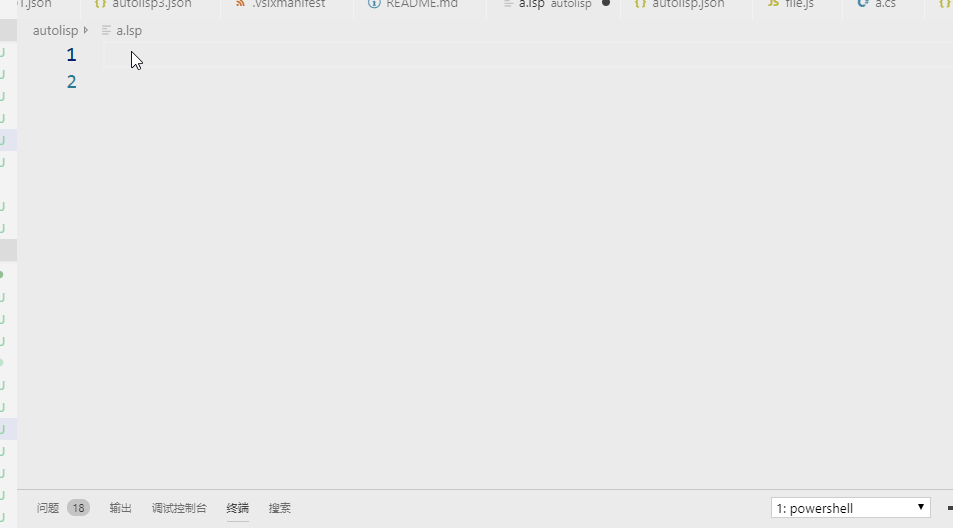
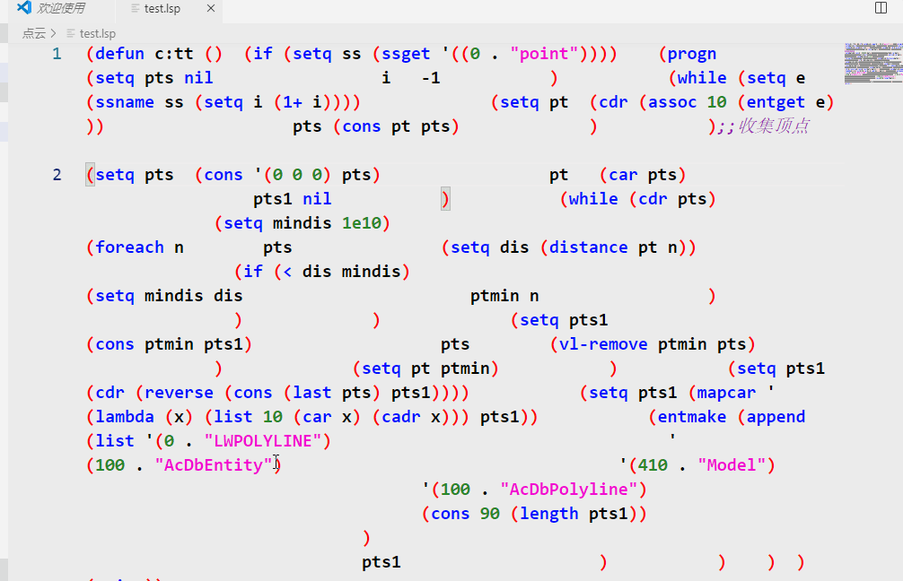

## autolisp for Visual Studio Code


## Preview
智能提示

格式化


## Introduction

*	Theme
```
	A light classic theme
```
*	Language service
```
	Auto-Completion 
	Syntax Highlight
```
## 功能
* 代码片段
* 自动完成
* 悬停提示
* 函数签名提示
* 代码格式化

## Requirements   

## 文档
[文档](doc.md)


	
	
## Release Notes

* 0.2.0 - 2019-11-06
	添加函数签名提示
	修复bug

* 0.0.7 - 2019-10-16
	修复缩进bug

* 0.0.1 - 2019-08-12

	第一个版本，欢迎大家提意见

## 致谢
* 落魄山人

## 联系方式
* 微信: niaoge33
* qq：1833183060
* qq群：720924083
-----------------------------------------------------------------------------------------------------------


