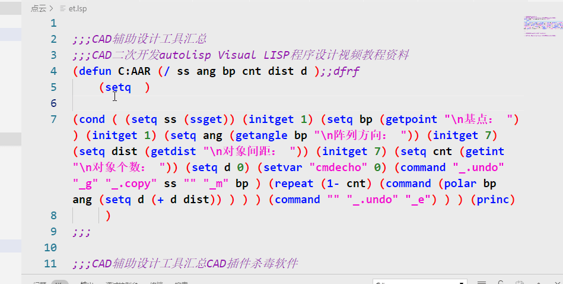
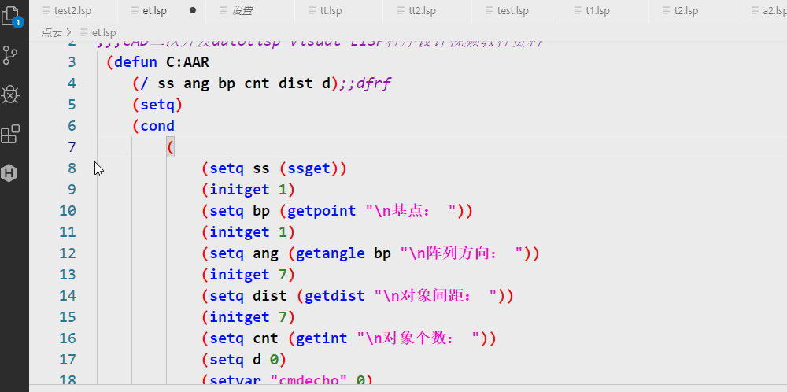
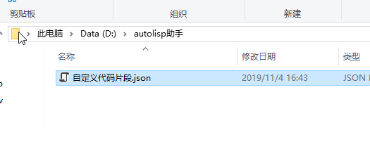
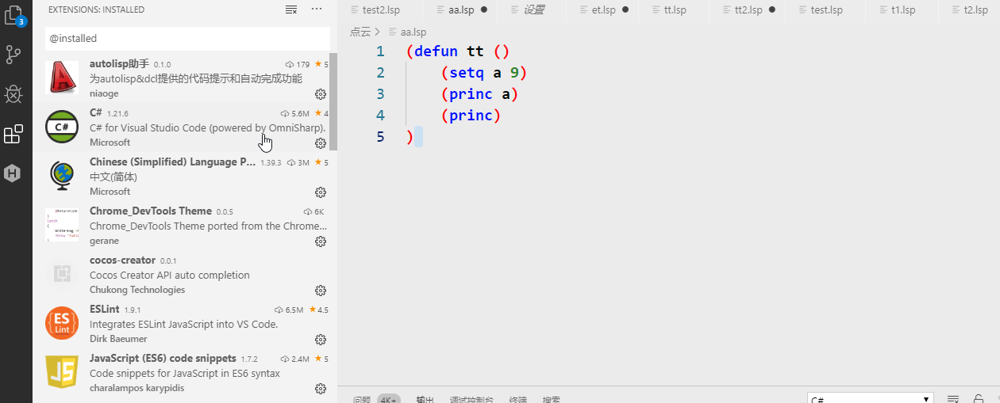

# autolisp助手使用说明

## 格式化

* 右键菜单  



* 配置
  

## 代码片段和函数签名


## 自定义代码片段

* 1、编写代码片段，示例如下：

```
{
    "filteror":
    {"prefix":["filteror"],"body":"'((-4 . "<or")(0 . "line")(0 . "text")(-4 . "or>"))",
        "params":[],
        "description":"选择直线或单行文字"},
    "makeline":{"prefix":["makeline"],"body":"(entmake (list '(0 . "LINE") (cons 10 pt1) (cons 11 pt2)))",
        "params":[],
        "description":"创建直线"}
}
```

* 2、将上述内容保存到json文件，比如：D:\autolisp助手\自定义代码片段.json
  

* 3、将代码片段文件的路径设置到autolisp助手的配置里
  